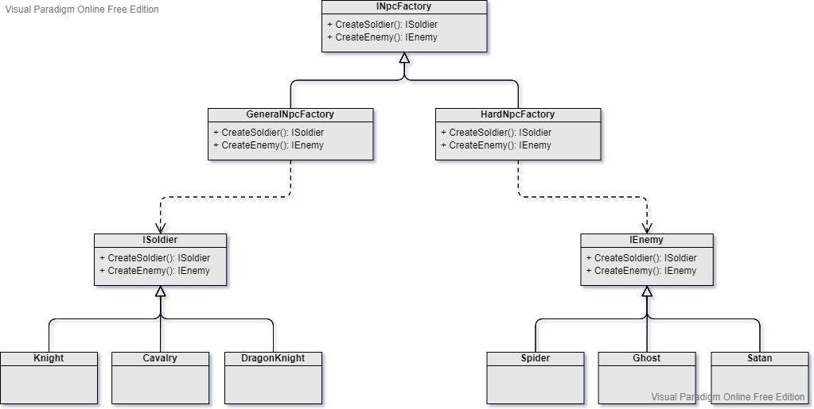

Factory
===
Scenario: When the creation of many object types is required, and or, the process of creating an object is very complex.

Pattern: An abstract or concrete factory class that handles the creation of each type of object by input parameter information.

Example: Creates elf, spider, skull and wolf enemies, and their properties can vary in different stages or different player level

