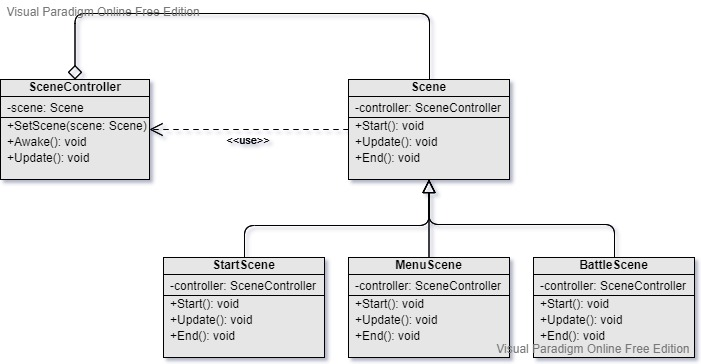

State Machine
===
Scenario: When there exists state transitions.

Pattern: Make each state a class. Transits these states one to another.

Examples:
- Scene: Main menu -> Character selection -> Battle -> End and score
- Character state: Idle -> Jump -> Idle -> Attack -> Idle
- Stage: Stage 1 -> Stage 2 -> Stage 3
- Battle state: Intro -> Fight -> End and result

