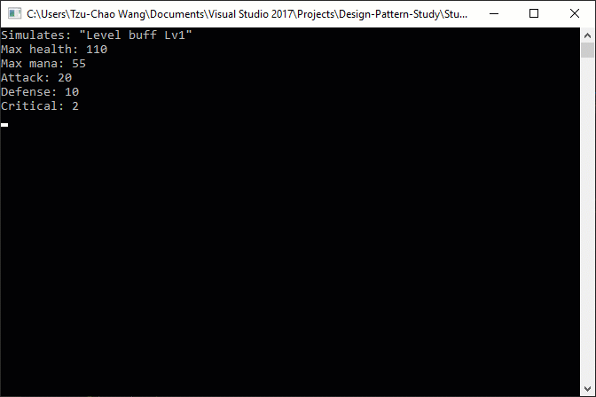

Buff
===
Studies the buff system concept that used by many many games.

The buff classes are mix-down of Chain of Responsibility and Decorator. The relationship between the equipments and the buffs are realized by bridge design pattern. The character class is the container that makes Chain of Responsibility work.